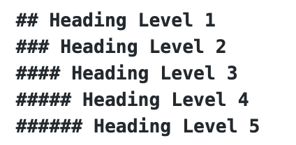
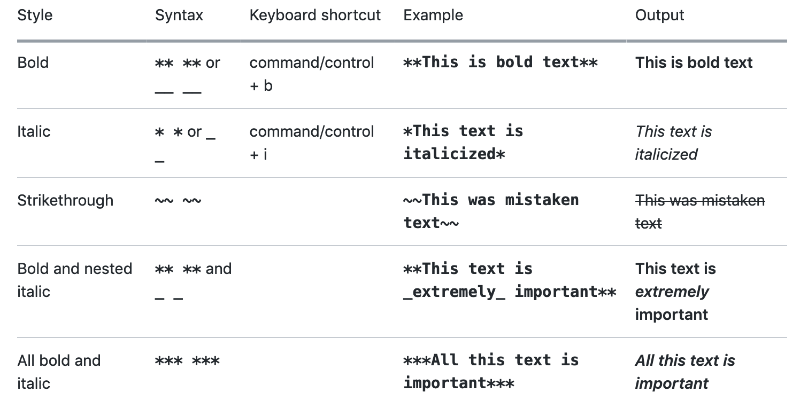
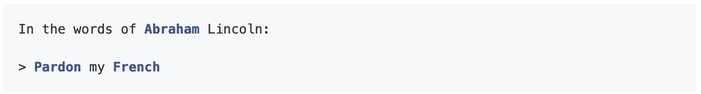
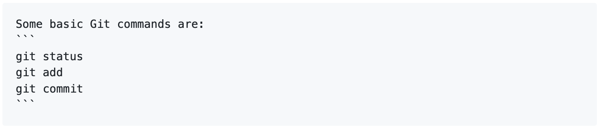

## Headings
To create a heading, add **two** to **six** `#` symbols before your heading text.
<figure>
	
	<figcaption>Headings</figcaption>
</figure>

add a new line.

## Heading Level 1
### Heading Level 2
#### Heading Level 3
##### Heading Level 4
###### Heading Level 5

## Styling Text
### Outside of a Table
<figure>
	
	<figcaption>Styling Outside Table</figcaption>
</figure>

### Inside of a Table
TBD

## Quoting
### Quoting Text
You can quote text with `>`.
<figure>
	
	<figcaption>Quoting Text</figcaption>
</figure>

In the words of Abraham Lincoln:
> Pardon my French

### Quoting Code
You can call out code or a command within a sentence with single backticks. The text within the backticks will not be formatted.
<figure>
	
	<figcaption>Quoting Code 1</figcaption>
</figure>

Use `git status` to list all new or modified files that haven't yet been committed.

To format code or text into its own distinct block, use triple backticks.
<figure>
	git 
	<figcaption>Quoting Code 2</figcaption>
</figure>
Some basic Git commands are:

```
git status
git add
git commit
```
## Links
### Section Links
### Relative Links
### Table Links
